# Ferramenta de Manipulação de Trends em XML

## 1. Motivação

Este aplicativo foi desenvolvido para facilitar a manipulação de arquivos de trend em formato XML utilizados no EBO (EcoStruxure Building Operation).

Em ambientes reais, é comum que medições históricas precisem ser ajustadas devido a falhas operacionais ou inconsistências. A ferramenta permite editar, excluir, gerar ou converter dados de trend de forma estruturada e segura, evitando edições manuais no XML.

### Principais cenários de aplicação

1. Manutenção de equipamento que distorceu medições durante determinado período.
2. Aplicação de offset incorreto em um intervalo específico.
3. Falha de sensor que gerou valores incongruentes.
4. Importação de dados históricos a partir de planilhas Excel.
5. Geração de trends sintéticas para testes de telas, gráficos e validação de lógica.

---

# 2. Por Onde Começar?

## 2.1 Como Extrair uma Trend em XML

A base deste aplicativo são arquivos XML exportados diretamente das trends do EBO.

Para extrair corretamente todos os valores:

1. Navegue até a trend desejada.
2. Ajuste a visualização para conter **todos os registros existentes**.
   - Exemplo: se a trend possui 5.000 registros, configure a visualização para 5.000.

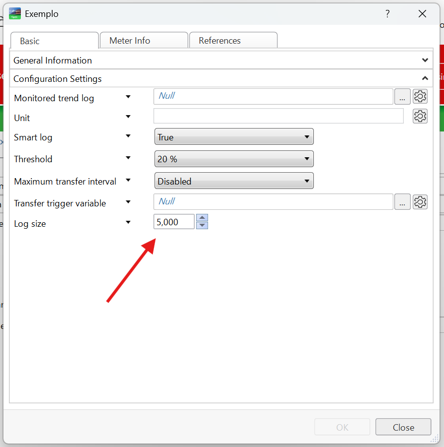  
> Exemplo de trend com 5 mil registros.

3. Ajuste o campo de visualização conforme indicado.

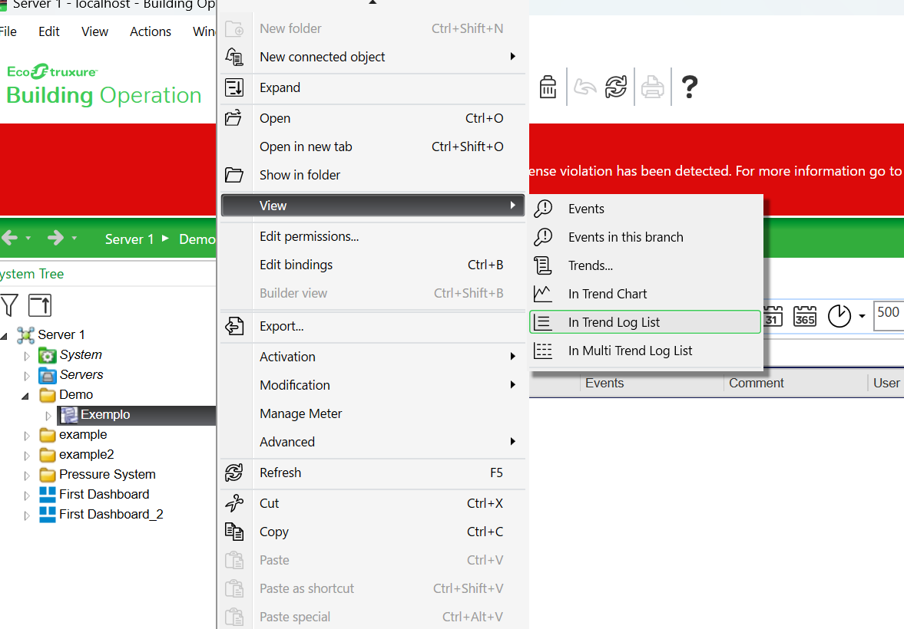

4. Visualize todos os dados e exporte como XML.

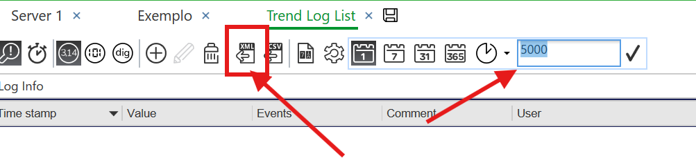

---

### Exemplo de Estrutura XML

```xml
<?xml version="1.0" encoding="utf-8"?>
<LogRecords Log="storage" LogDescription="" LogPath="/Server 1/example/storage" Unit="NoUnit" Signal="/Server 1/example/Value" Locale="ja-JP" Max="NaN" Min="NaN" Average="NaN" Count="1" StartTime="2026/02/12 19:49:21" EndTime="2026/02/12 19:49:21" Description="">
  <TrendLogEventRecord Timestamp="2026/02/12 19:49:21" Value="1001" Events="" Comment="" User="" />
</LogRecords>
```

A aplicação preserva os metadados originais e recalcula automaticamente:

- Valor máximo
- Valor mínimo
- Média
- Data inicial
- Data final

---

# 3. Funcionalidades do Aplicativo

Utilizaremos a seguinte trend como exemplo:

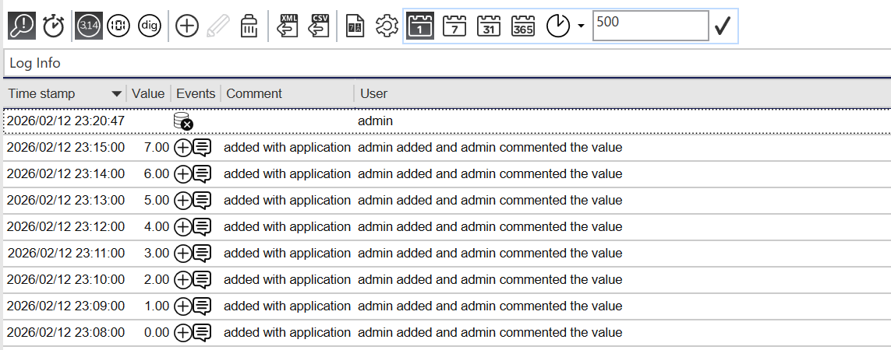

---

# 3.1 Deletar Intervalo de Dados

Permite remover todos os registros dentro de um intervalo específico de tempo.

### Exemplo

Remover dados de:

```
12/02/2026 23:10:00 até 12/02/2026 23:13:00
```

### Passo 1

Clique em:

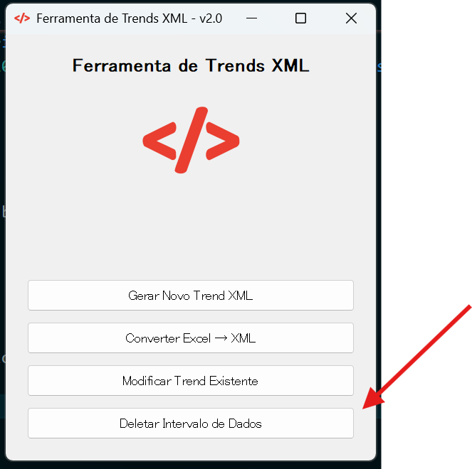

### Passo 2

Selecione o XML exportado e defina o intervalo:

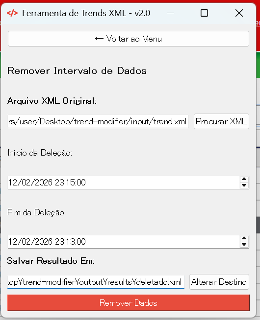

Você também pode alterar o nome do arquivo de saída.

Clique em **Remover Dados**.

O sistema irá:

- Carregar o XML
- Converter timestamps para datetime
- Remover registros dentro do intervalo (inclusive)
- Recalcular estatísticas
- Gerar um novo XML

---

### Importando novamente no EBO

Antes de importar o novo arquivo:

1. Exclua a trend original para evitar duplicidade.

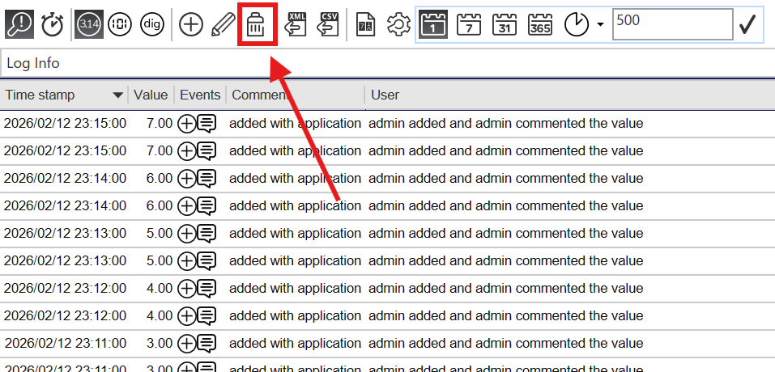

2. Utilize **Import Log Data**.

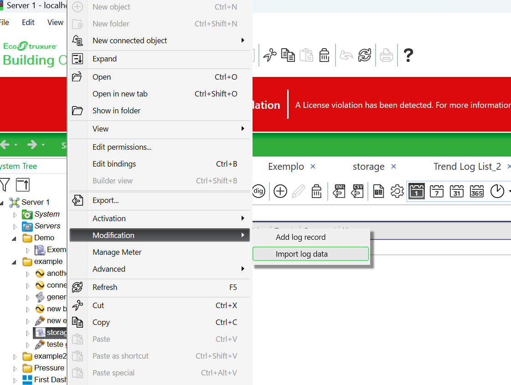

3. Selecione o XML gerado na pasta `output/results`.

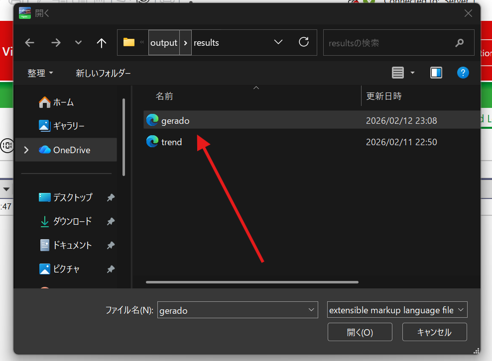

Resultado esperado:

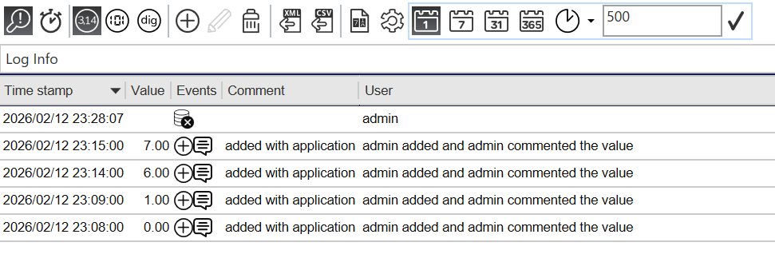

---

# 3.2 Modificar Trend Existente

Permite substituir valores dentro de um intervalo por:

- Um valor constante
- Uma função matemática

### Modos disponíveis

- valor_constante
- linear
- linear_double
- sin
- cos
- square
- sqrt
- log

### Acessando a funcionalidade

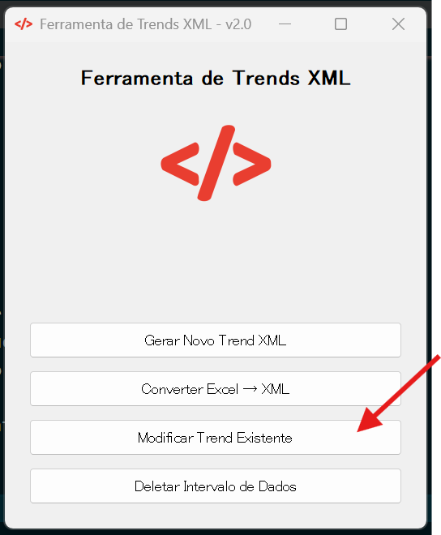

### Exemplo

Modificar o intervalo:

```
12/02/2026 23:10:00 até 12/02/2026 23:13:00
```

Para valor:

```
1001
```

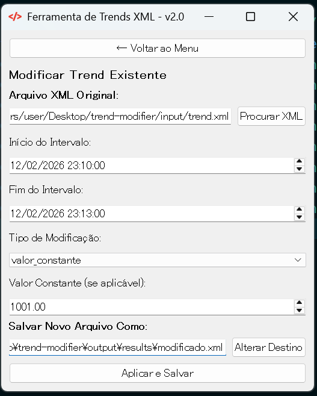

Clique em **Aplicar e Salvar**.

Internamente, o sistema:

- Gera novos valores no intervalo
- Substitui registros existentes
- Reordena cronologicamente
- Recalcula estatísticas
- Gera novo XML

Resultado após importação:

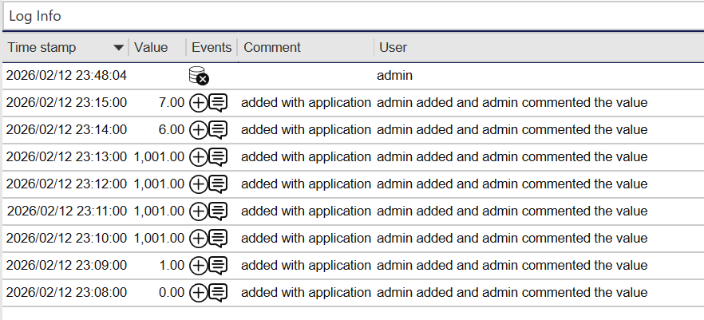

---

# 3.3 Gerar Novo Trend XML

Permite criar uma trend sintética para testes.

Acesse:

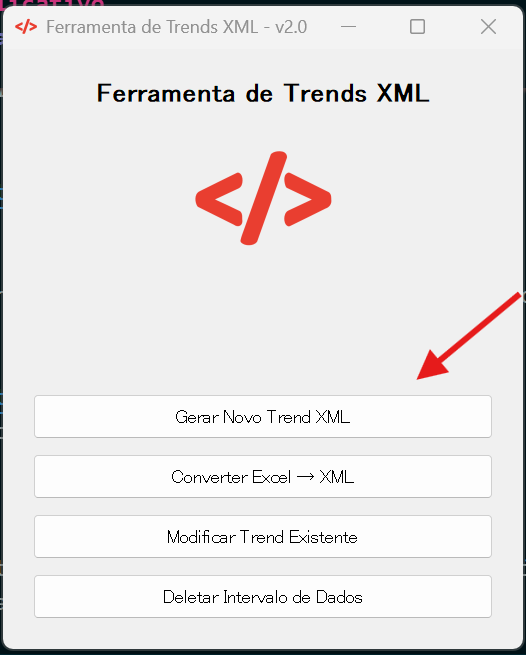

### Parâmetros disponíveis

- Data inicial
- Data final
- Frequência:
  - segundo
  - minuto
  - hora
  - dia
- Tipo de cálculo:
  - linear
  - linear_double
  - sin
  - cos
  - square
  - sqrt
  - log

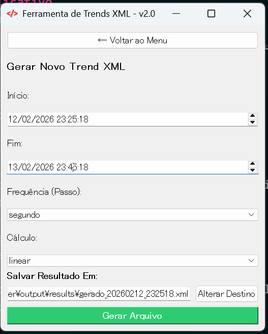

O sistema:

- Gera sequência de timestamps
- Aplica função matemática
- Arredonda valores (5 casas decimais)
- Calcula máximo, mínimo e média
- Gera XML compatível com EBO

O arquivo pode ser importado em uma trend vazia.

---

# 3.4 Converter Excel para XML

Permite gerar um XML a partir de uma planilha Excel.

Acesse:

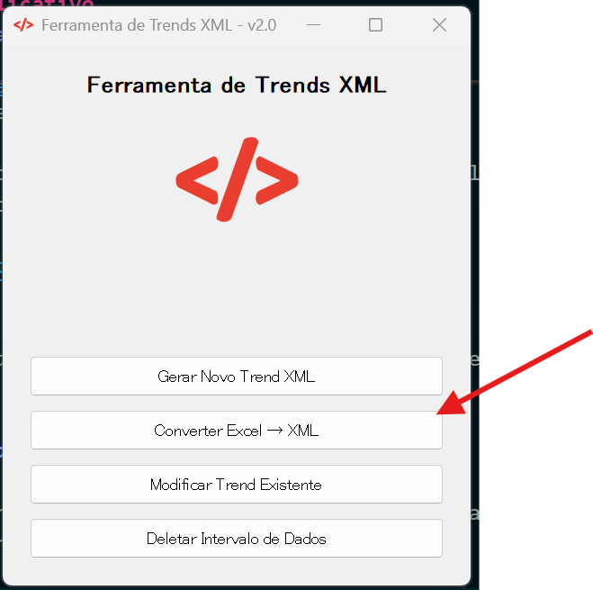

### Estrutura obrigatória do Excel

A planilha deve conter exatamente:

```
timestamp | value
```

Exemplo:

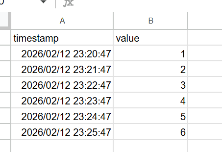

Regras obrigatórias:

- Colunas exatamente: `timestamp` e `value`
- Sem células vazias
- Valores numéricos na coluna `value`
- Timestamps em ordem crescente
- Datas válidas

Selecione o arquivo:

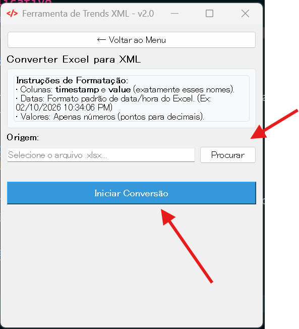

O sistema irá:

- Validar colunas
- Validar ordenação
- Validar tipo numérico
- Converter timestamps
- Calcular estatísticas
- Gerar XML

Resultado no EBO:

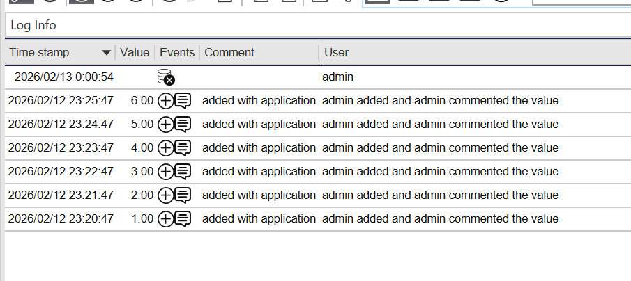

---

# 4. Observações Importantes

- O arquivo original nunca é sobrescrito.
- Sempre mantenha backup da trend original.
- Exclua a trend antes de reimportar para evitar duplicidade.
- Estatísticas são sempre recalculadas com base nos dados finais.

